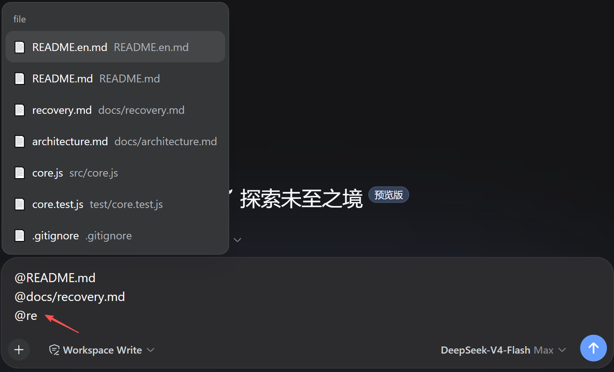

# @hucj/dsh-file-mention

[English](README.en.md) | 中文

DSH（DeepSeek Harness）Web GUI 的 **`@` 关联工作区文件**插件：在聊天输入框输入 `@`，按输入字符实时过滤并选择工作区文件，选中后插入 `@相对路径`，模型即可直接读取该文件——类似 Codex CLI / Claude Code CLI 的 `@file` 引用体验。

> npm 包名 `@hucj/dsh-file-mention`（个人 scoped 包）；插件组合行 id 为 `file-mention`。

- **git 驱动过滤**：跟踪文件 + 未跟踪且未被忽略的新文件（新建文件无需 `git add` 即可 @ 引用）；天然遵守 `.gitignore`，编译产物自动排除
- **`.aiinclude` 重新纳入**：被忽略、但 AI 需要访问的文件（如项目文档）可显式加回扫描范围
- **零外部依赖**：Host/Client 双端均为纯手写代码 + 手写构建脚本

## 功能特性

| 特性 | 说明 |
|------|------|
| `@` 输入触发 | 与技能 `/` 菜单、`@pluginId`、`@子代理` 同一套 `inputTriggers` 机制，多源并存 |
| 实时过滤 | 按文件名或完整路径匹配（大小写不敏感），最多展示 100 条 |
| 类型图标 | 按扩展名区分 4 类图标：⌨️ 代码 / 📝 文档 / 🖼️ 图片 / 📄 其他；目录显示 📁 |
| 目录引用 | 目录由文件列表自动派生（零额外扫描），可 @ 选中并插入 `@docs/ ` 供模型探索目录内容；**逐级展开**——`@app` 顶层、`@app/` 第二层、`@app/src/` 再进一层；**单段查询直达子目录**（`@10_logcat_analyze` 直接命中 `docs/10_logcat_analyze/`，无需输完整路径） |
| 菜单适配 | 候选菜单加宽至 720px（官方默认 537px）+ 行字号 14→13px + 行高压缩（40→32px，同屏 +25% 行数）（高特异性选择器覆盖官方 CSS，仅影响 `@` 候选菜单） |
| 命中排序 | **精确匹配**（路径/basename 全等）→ **前缀匹配** → 子串匹配（组内再按变更优先 + 字母序） |
| 默认排序 | **最近修改/新增的变更文件置顶（上限 5 个，按修改时间降序）** → 📁 目录（字母序）→ 其余变更 + 普通文件（字母序）→ 隐藏路径 |
| git 跟踪过滤 | `git ls-files -c` 跟踪文件 ∪ `-o --exclude-standard` 未跟踪非忽略文件；新建文件自动出现，编译产物不进来 |
| 删除/重命名 | 已删除文件自动隐藏（`git ls-files -d`）；重命名（git mv）文件按未提交变更置顶 |
| `.aiinclude` | gitignore 语法，把忽略目录/文件重新纳入（目录规则含子级继承，支持子目录嵌套配置） |
| 回退模式 | git 不可用/非仓库时自动降级为 `.gitignore` 解析 + 全量扫描 |
| 缓存 | 客户端按**工作区 cwd 共享** + **stale-while-revalidate**（TTL 30s 过期先返回旧列表、后台刷新，`@` 永远零等待）；Host 侧 git 结果分层缓存（仓库根 60s / 跟踪列表 15s / 变更与未跟踪与已删除 5s）；会话创建时后台预热（warm 钩子） |
| 剪枝遍历 | `.aiinclude` 只遍历可能命中的目录（doc/ 场景实测 16ms vs 全树 822ms） |
| 安全边界 | 文件总数上限 10000、遍历深度 32、跳过重型目录 |

### 功能演示

在输入框输入 `@` 即弹出工作区文件菜单：实时按文件名/路径过滤，未提交变更（含新建文件）优先展示，选中后插入 `@相对路径`，模型可直接读取该文件：



> 上图为运行效果示例；新建（未跟踪）文件无需 `git add` 即可被 @ 关联（v0.1.10+）。

## 安装

### 方式一：npm 发布后（推荐）

```bash
dsh plugin --profile web add @hucj/dsh-file-mention
```

### 方式二：本地路径（开发调试）

先从源码**编译**（lib/ 是构建产物，随包发布，源码改动后必须重新构建再安装）：

```bash
git clone git@github.com:hucj09/dsh-file-mention.git   # 或使用已有源码目录
cd dsh-file-mention
npm install        # 仅开发依赖（构建/测试用；产物本身零外部依赖）
npm run check      # 编译（src/ → lib/）+ 30 个单元测试
```

然后安装：

```bash
dsh plugin --profile web add file:D:/path/to/dsh-file-mention
```

`file:` 安装为**一次性拷贝**（非符号链接）：项目源码后续改动不会自动同步到安装目录，需要**重新编译后重新安装**（或手动同步 `lib/`、`package.json`、`README.md`、`cordis.patch.yml`）。

安装后**重启 dsh web**（新 bundle 只在下次启动时加载），浏览器 **Ctrl+F5** 强刷，输入框输入 `@` 出现 file 分组即安装成功。

> 注：`dsh.client.inject` 为空、插件自身 `inject: ['inputTriggers']` 声明硬依赖，宿主需已组装 `@deepseek-ai/dsh-client-ui-input-trigger`（标准 web 部署默认包含）。

## 卸载

```bash
dsh plugin --profile web remove @hucj/dsh-file-mention
```

该命令自动完成三件事（实测验证）：
1. 从 `dependencies` 删除依赖
2. 从 `dsh.profile.bundles` 删除 bundle 行
3. 删除 `node_modules/@hucj/dsh-file-mention` 安装目录

之后**重启 dsh web** 生效。若想彻底清理项目缓存，可手动删除 `node_modules` 下的 `@hucj` 目录与 pnpm 缓存。

## `.aiinclude` 配置

在**工作区根目录**创建 `.aiinclude` 文件（语法与 `.gitignore` 一致）：

```gitignore
# 被 .gitignore 忽略、但 AI 需要 @ 访问的文件/目录
doc/
.superpowers/sdd/**
.vscode/settings.json
build/generated/**
```

| 语法 | 含义 | 示例 |
|------|------|------|
| `#` | 注释 | `# 说明` |
| `dir/` | 目录规则，其下所有文件（含子级）纳入 | `doc/` |
| `path/**` | 目录下任意深度 | `.codebuddy/**` |
| `*.ext` | 任意层级的 basename 匹配 | `*.log` |
| `!pattern` | 否定（最后匹配者生效） | `!doc/private/` |
| `/pattern` | 锚定于工作区根 | `/build` |

修改后数据在 **~90 秒内收敛**（Host 规则缓存 60s + 客户端列表 30s），刷新页面可加速客户端部分。

### 子目录嵌套配置

子目录也可以放自己的 `.aiinclude`（gitignore 层级语义：规则相对该目录生效，且**覆盖**根配置）：

```gitignore
# doc/.aiinclude —— 只对 doc/ 下生效
!private/            # 排除 doc/private（根配置 doc/ 的继承在此被覆盖）
*.md                 # 额外纳入 doc/ 下任意深度的 .md
```

嵌套规则会展开为根相对规则并与根规则合并（后读入者优先，`!` 否定同样生效）。
限制：需要**根 `.aiinclude` 存在**才触发嵌套发现；`node_modules` 等重型目录内的嵌套配置不读取。

### 典型场景

- 项目文档目录不入库（`.gitignore: doc/`），但 AI 复盘/查询需要 → `.aiinclude: doc/`
- 本地辅助工具产物不入库，但 AI 需要读取 → `.aiinclude: .superpowers/**`
- 不希望 `.aiinclude` 本身入库 → 在 `.gitignore` 中追加 `.aiinclude`

## 开发

```bash
npm run build   # 构建 src/ → lib/（零依赖，纯拷贝 + 语法校验）
npm test        # 匹配器单元测试（node:test，35 用例）
npm run test:it # host 集成测试（真实 git + 真实 fs，模拟开发场景，18 用例）
npm run check   # 构建 + 单元测试 + 集成测试（发布前全跑）
```

### 目录结构

```
src/
  core.js     # gitignore/.aiinclude 规则匹配核心（纯函数，可独立测试）
  host.js     # Host 半体：git ls-files + .aiinclude 扫描（/file-mention/list HTTP 路由）
  client.js   # Client 半体：@ 输入触发源（inputTriggers）
scripts/
  build.mjs   # 构建：内联 core 并生成 lib/index.js（ESM）与 lib/client.js（__ModuleLoader__ 包装）
test/
  core.test.js
lib/          # 构建产物（随包发布，安装即用）
docs/
  architecture.md   # 架构与设计说明
```

> 维护规则（版本号策略、构建不变式、同步清单、提交规范）见 **[AGENTS.md](AGENTS.md)**。

## 架构摘要

```
浏览器输入框输入 @
  → inputTriggers 触发 file 源
  → POST /file-mention/list（{ sessionId }）
  → Host：git ls-files（跟踪 ∪ 未跟踪非忽略）∪ .aiinclude 扫描（重新纳入）
  → 返回相对路径列表 → 过滤展示 → 选中插入 @路径
  → 模型收到路径文本，用文件工具读取
```

详见 [docs/architecture.md](docs/architecture.md)。

## License

[MIT](LICENSE) © 2026 hucj

---

详细文档：[docs/architecture.md](docs/architecture.md)（架构设计）· [docs/recovery.md](docs/recovery.md)（故障恢复）· [AGENTS.md](AGENTS.md)（维护规则与发布流程）
